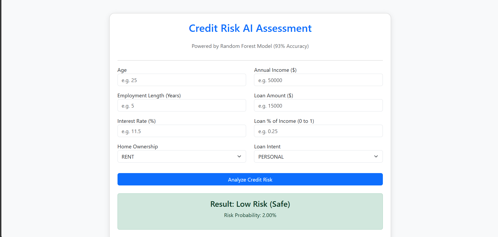
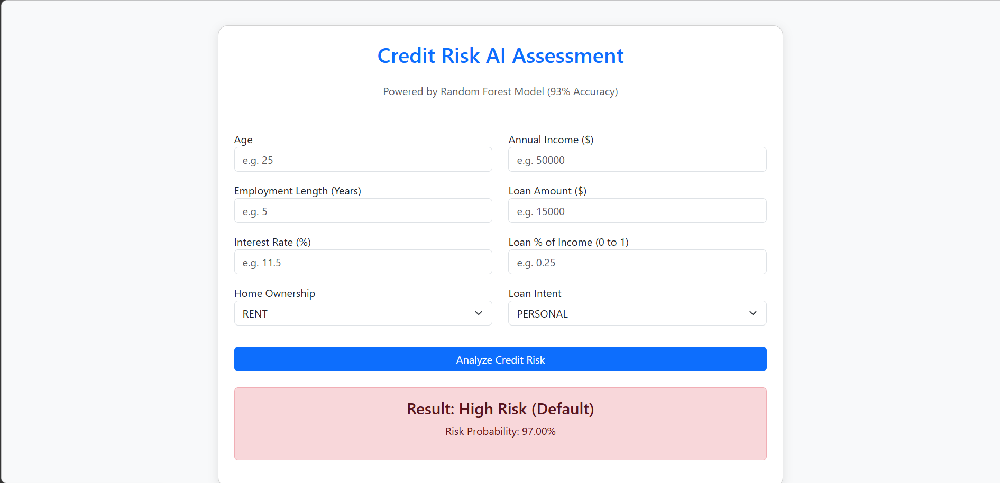
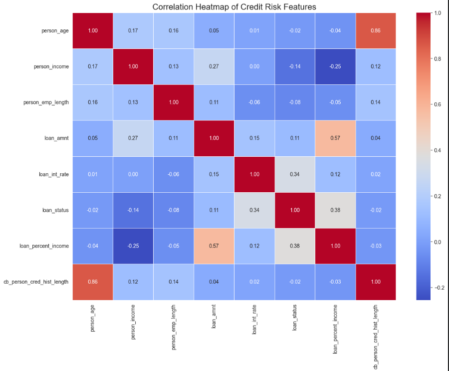
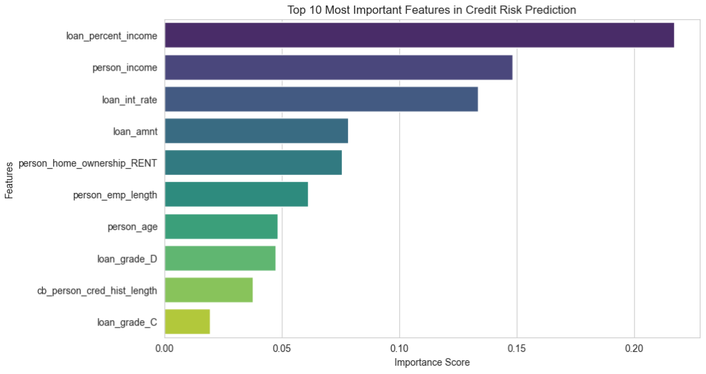

# Credit Risk Assessment System (AI Predictor)


##  Project Overview
This project is a comprehensive machine learning solution designed to help financial institutions predict the probability of loan defaults. Following the **IBM Data Science Methodology**, I developed a predictive engine that analyzes applicant data to categorize credit risk into "High" or "Low".

The final model achieved a peak accuracy of **93%** using a Random Forest Classifier.

##  Features
- **Exploratory Data Analysis (EDA):** In-depth analysis of financial features and correlations.
- **Robust Preprocessing:** Advanced data cleaning, handling of extreme outliers, and missing value imputation.
- **Machine Learning Pipeline:** Comparative analysis between Logistic Regression and Random Forest.
- **Real-time Prediction:** A Flask-based web application that allows users to input applicant data and receive instant risk assessments.
- **Feature Importance:** Insights into the top factors driving credit risk (Interest rates, Income, etc.).

##  Tech Stack
- **Languages:** Python (Pandas, NumPy)
- **Visualization:** Matplotlib, Seaborn
- **Machine Learning:** Scikit-Learn (Random Forest, Logistic Regression)
- **Web Backend:** Flask
- **Frontend:** HTML5, CSS3, Bootstrap 5

##  Model Performance
After rigorous testing and evaluation, the results were as follows:

| Model | Accuracy | Precision (Default) | Recall (Default) |
| :--- | :--- | :--- | :--- |
| **Random Forest** | **93%** | **96%** | **71%** |
| Logistic Regression | 85% | 76% | 44% |


## 📸 Visual Insights & Demo

### 1. Web Interface Demo
This is the interactive dashboard where users can input financial data to get an instant credit risk assessment.


*Figure 1: Flask Web Application - Real-time Risk Prediction*

### 2. Feature Importance Analysis
Using the Random Forest model, we identified the top 10 factors that influence loan default.

*Figure 2: Top factors influencing credit risk based on the model's insights*

### 3. Data Correlation Heatmap
Understanding the relationship between different financial variables.

*Figure 3: Heatmap of numerical features during the EDA phase*


##  Installation & Setup
1. **Clone the repository:**
   ```bash
   git clone [https://github.com/A-rahhal/Credit-Risk-Predictive-ML.git](https://github.com/A-rahhal/Credit-Risk-Predictive-ML.git)


2. **Navigate to the project directory:**
   ```bash
   cd Credit-Risk-Predictive-ML
Install dependencies:

Bash
pip install -r requirements.txt
Run the Application:

Bash
python app.py
Access the App: Open your browser and go to http://127.0.0.1:5000

📂 Project Structure
Plaintext
├── app.py                  # Flask Backend Application
├── credit_risk_model.pkl   # Pre-trained Random Forest Model
├── model_columns.pkl       # Feature alignment configuration
├── dataset/                # Dataset source (CSV)
├── templates/              # HTML frontend (index.html)
└── Credit_Risk_ML.ipynb    # Jupyter Notebook with full EDA & Training
💡 Key Insights from the Model
Interest Rate: The most significant predictor of default; higher rates correlate strongly with high-risk profiles.

Income & Debt Ratio: Applicants with lower annual income and high loan-to-income ratios are flagged as higher risk.

Employment History: Stability in employment is a key defensive factor against credit default.

🎓 Certification Context
This project serves as a practical validation of the machine learning skills acquired through the IBM Machine Learning Professional Certificate. It demonstrates a complete end-to-end pipeline from raw data to a functional web-based AI tool.

👤 Author
Anas Rahhal

University: Tafila Technical University (TTU)

Specialization: AI & Data Science

GitHub: A-rahhal

Email: arah7al@gmail.com

my website: https://anas-rahhal.me